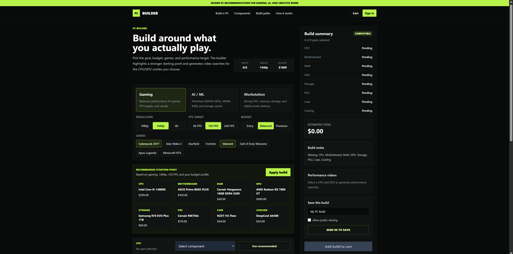
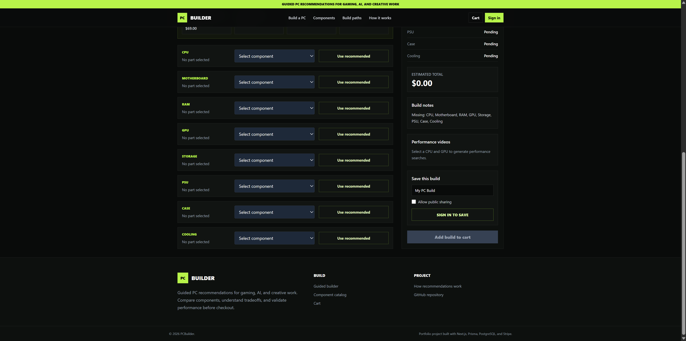
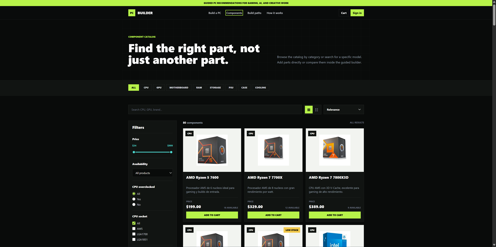
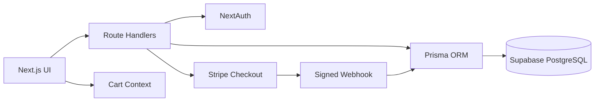

# PCBuilder

PCBuilder is a fullstack ecommerce and recommendation platform for creating custom PCs around a real workload. Users can browse components, receive guided recommendations for gaming, AI, or workstation use, validate compatibility, save and share builds, and complete an authenticated Stripe checkout.

## Live Demo

**[pcbuilder-olive.vercel.app](https://pcbuilder-olive.vercel.app)**

The catalog and guided builder can be explored without an account. Google sign-in is required to create orders or save builds. Stripe runs with test credentials when configured.

## Product Preview

### Guided PC Builder

Choose the workload, performance target, budget, and games to receive a balanced starting point with compatibility feedback.



### Component Selection

Review every required part, replace individual recommendations, see the estimated total, and save or add the completed build to the cart.



### Component Catalog

Browse 80 seeded components using category tabs, search, technical filters, sorting, and grid or list layouts.



## Why This Project

Most component catalogs expect users to already understand hardware. PCBuilder starts with the intended result: resolution, FPS target, games, AI workloads, or creative work. It then recommends components, explains tradeoffs, checks compatibility, and creates targeted YouTube benchmark searches for the selected CPU/GPU combination.

## Main Features

- Guided builds for gaming, AI/ML, and workstation use
- Structured compatibility checks for socket, RAM, PSU, case, GPU, and cooling
- Incompatible component options disabled before selection
- Searchable catalog with technical filters, sorting, grid view, and list view
- Shareable catalog URLs with synchronized filters and pagination
- Persistent cart using React Context and local storage
- Google OAuth authentication with NextAuth
- Saved private builds and publicly shareable build URLs
- Server-validated orders and Stripe Checkout sessions
- Signed Stripe webhooks with amount validation and idempotent stock updates
- Authenticated order history
- PostgreSQL migrations and reusable product seed
- Role-protected administration for products, pricing, stock, and featured items
- Automated unit and Playwright end-to-end tests in GitHub Actions
- Optional Sentry error and performance monitoring
- Responsive UI verified on desktop and mobile viewports
- Loading state, error boundary, 404 page, sitemap, and social metadata

## Tech Stack

| Area | Technology |
| --- | --- |
| Frontend | Next.js App Router, React, Tailwind CSS |
| Backend | Next.js Route Handlers |
| Database | PostgreSQL on Supabase |
| ORM | Prisma |
| Authentication | NextAuth with Google OAuth |
| Payments | Stripe Checkout and webhooks |
| State | React Context API and local storage |
| Testing | Node.js test runner |
| CI/CD | GitHub Actions and Vercel |

## Architecture



Server Components load products, orders, and saved builds close to the database. Client Components are limited to interactive workflows such as filters, cart state, builder selections, and account actions.

## Compatibility Model

Product specifications are stored as structured database fields instead of being inferred only from display names. Current checks include:

- CPU socket against motherboard socket
- RAM generation against motherboard memory type
- Motherboard form factor against case support
- GPU recommended PSU wattage
- GPU length against case clearance
- CPU cooler socket support
- Air cooler height against case clearance
- Radiator size against case support

The compatibility engine lives in [`lib/compatibility.js`](lib/compatibility.js) and is independent from the UI so it can be tested and reused by API routes.

## Payment Security

The browser never defines the Stripe price. Checkout receives an authenticated `orderId`, loads the order and price snapshots from PostgreSQL, verifies ownership and stock, and creates Stripe line items on the server.

The webhook verifies:

- Stripe signature
- Payment status
- Currency and expected total
- Pending order state
- Available stock
- Idempotency before decrementing inventory

## Database Models

- `Product`: catalog data, stock, and structured hardware specifications
- `User`: authenticated customer profile
- `Order` and `OrderItem`: checkout price snapshots and payment state
- `Build` and `BuildItem`: saved configurations, visibility, and selected components

## Local Setup

```bash
npm install
cp .env.example .env.local
npm run dev
```

Open `http://localhost:3000`.

Required environment variables:

```env
DATABASE_URL="postgresql_connection_string"
NEXTAUTH_URL="http://localhost:3000"
NEXTAUTH_SECRET="generated_secret"
GOOGLE_CLIENT_ID="google_client_id"
GOOGLE_CLIENT_SECRET="google_client_secret"
ADMIN_EMAILS="admin@example.com"
STRIPE_SECRET_KEY="stripe_test_secret"
STRIPE_WEBHOOK_SECRET="stripe_webhook_secret"
NEXT_PUBLIC_APP_URL="http://localhost:3000"
NEXT_PUBLIC_SENTRY_DSN=""
SENTRY_DSN=""
```

`ADMIN_EMAILS` accepts a comma-separated list. Sentry variables are optional; monitoring remains disabled when the DSN is empty.

Apply migrations and seed products:

```bash
npx prisma migrate deploy
npm run db:seed
```

## Quality Checks

```bash
npm test
npm run test:e2e
npm run lint
npm run build
```

Playwright runs the public storefront flows in desktop Chromium and an emulated Pixel 7 viewport. GitHub Actions runs unit tests, lint, build, and E2E tests on pushes to `main` and pull requests. A manual production checklist is available in [`docs/manual-testing.md`](docs/manual-testing.md).

## Administration

1. Add your Google account email to `ADMIN_EMAILS`.
2. Apply migrations with `npx prisma migrate deploy`.
3. Sign out and sign in again so the JWT receives the administrator role.
4. Open `/admin`.

The admin page and every mutation endpoint verify authorization independently. Hiding the navigation link is not used as the security boundary.

## Demo Flow

1. Select Gaming, AI/ML, or Workstation in the guided builder.
2. Choose resolution, FPS, budget, and games.
3. Apply the recommended build or replace individual components.
4. Review compatibility and benchmark searches.
5. Sign in to save the build, make it public, and copy its URL.
6. Add the configuration to the cart and start Stripe test checkout.
7. Review the resulting order status in Order History.

## Current Limitations

- Performance recommendations are heuristic rather than benchmark-dataset driven.
- Product prices represent the demo catalog and are not synchronized with retailers.
- Google OAuth and Stripe require valid provider credentials.
- Sentry requires a project DSN before events can be delivered.
- Dependency auditing currently reports upstream transitive advisories in Prisma tooling, Sentry build tooling, and the PostCSS version bundled by Next.js.

## Next Improvements

- Benchmark dataset for estimated FPS and AI workload scoring
- Retailer price and availability synchronization
- Authenticated E2E coverage for saved builds, administration, and Stripe test checkout
